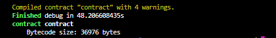

[note]: <> ("note to self and file editor, there are specific comments left throughout this file, for the sake of understanding the author's reason for using a particular method of approach; please feel free to delete once acknowledged or reply edit with a better approach 🥂")

# How to Build a DAO on the Fuel blockchain.

## Introduction

A Decentralized Autonomous Organization (DAO) is considered an essential blockchain application.

It is a decentralized application that users or organizations use to automate the governance of their projects and communities. The automated program is represented by rules encoded in a network of computers that is transparently controlled by the organization members and not influenced by any central authority.

By completing this article, you will learn how to create a Dao contract on the Fuel blockchain. You will also gain knowledge about the following concepts:

1. Writing a smart contract using the sway language.
2. Understanding how to use low-level code fundamentals in sway `asm`, `call`, etc.
3. Wallet configuration
4. How to compile and deploy to the Fuel blockchain.

## Prerequisites

To follow this tutorial seamlessly, you should be familiar with the following:

1. [Installation](https://docs.fuel.network/guides/installation/) of dependencies like `fuel`, `sway` extensions on vscode, `rustc`, `cargo`, `rustup` `cargo-generate`, on your machine.
2. Node version ^18.18.2 || ^20.0.0.
3. You should have `wsl` installed if you are using a Windows or Mac PC. You can use the code `wsl --install` to install `wsl`.
4. Knowledge of FuelVM and other Fuel tools.
5. Basic concept of blockchain technology.
6. Writing, compiling, and deploying to any blockchain (EVM or non-EVM compatible blockchain).
7. Understand concepts of [ABIs](https://docs.fuel.network/guides/quickstart/building-a-smart-contract/#abi), Faucets, and wallet connect.

## Getting Started

Before you delve into the main topic, here are some concepts to jug your memory on the Fuel ecosystem and help you better understand words you will see throughout this tutorial.

**Fuel**: [Fuel](https://fuel.network/) is an operating system purpose-built for Ethereum rollups, designed to help developers build decentralized economies at scale.

**FuelVM**: The [Fuel Virtual Machine](https://medium.com/blockchain-capital-blog/exploring-the-fuelvm-86cf9ccdc159) responsible for managing all code execution on the Fuel blockchain

**Sway**: [Sway](https://fuellabs.github.io/sway/) is a domain-specific language for writing smart contracts on the Fuel blockchain.

**ABI**: These are called [Application Binary Interfaces](https://docs.fuel.network/guides/intro-to-sway/contract-abi/); they are the blueprint or interaction models of your smart contract, it is a layout of the detailed functionalities in your smart contract, and how to interact with it.

## Setting up your Environment

In the next few steps, you will set up your development environment to begin building the smart contract of your Dao.

1. Go to your terminal and run the command `wsl` to start your wsl terminal if you are using a Windows

2. Run the commands below in your terminal to generate your new contract directory and Fuel development workspace. (If you have previously not installed the Fuel toolchain, first run `curl https://install.fuel.network | sh` in your terminal.)

```bash
$ mkdir Fuel_Dao
$ cd Fuel_Dao
$ forc new contract
```

## Writing your Smart Contract

Head to the `main.sw` contract file, where you will implement your main contracts. Following the next few steps, you will replace the code therein.

### 1. Importing from the modules 
First, you will define the file as a contract and import the following modules from the sway standard library using the key `use` and namespace qualifier `::`: 
  
- `asset::transfer`: This provides the functionality for transferring assets.

- `auth::msg_sender`: The module retrieves the sender's address of the contract or a transaction.
  
- `block::height`: The module provides information about the current block height or block number
  
- `call_frames::msg_asset_id`: This provides information about the asset (token) associated with the current sent transaction.
  
- `context`: This module provides context-related functionality related to the execution context of your contract.
  
-  `hash::Hash`: This provides hashing-related functionality, such as integrity verification, cryptographic operations, and generating unique identifiers.
Copy and add the code below to your `main.sw` contract.

```rust
contract;

use std::{
    asset::transfer,
    auth::msg_sender,
    block::height,
    call_frames::msg_asset_id,
    context::{
      msg_amount,
      this_balance,
    },
    hash::Hash, 
  };
```

### 2. Importing The Library Contracts
Next, you will import other contract libraries and interfaces from the following, using the module keyword `mod` to import them from modules in the same directory as your `main.sw`.

Copy and replace the existing code in your `main.sw` file with the one below.

[note]: <> (I use Rust for all snippets rather than sway since both languages are similar and Rust's is recognized on prettifier for markdown code snippets)
  
```rust 
mod data_structures;
mod errors;
mod events;
mod interface;
mod utils;

// Import event types related to various actions within the DAO
use ::events::{
    CreateProposalEvent,
    DepositEvent,
    ExecuteEvent,
    InitializeEvent,
    UnlockVotesEvent,
    VoteEvent,
    WithdrawEvent,
};

// Import interfaces for DAO voting and information retrieval
use ::interface::{DaoVoting, Info};

// Import utility function for validating IDs
use ::utils::validate_id;
```
All of these are libraries you will be creating later in this tutorial. 

- `error`: define the error handlers for your contract.
- `data_structure`: defines functionalities for managing proposals and voting and defines methods for initializing your DAO.
- `events` defines a library of multiple `structs` that emit events when certain instances or functions are executed on-chain.
- `utils`: These will be instances emitted on-chain when certain events are met.
- `interface`: this is where you will implement your contract ABIs

### 3. Initializing Storage Variables

Next, you will initialize a set of persistent [storage](https://docs.fuel.network/docs/sway/blockchain-development/storage/#storage) needed throughout your contract.

***Note: Storage initialization is one of the similar patterns in [Solidity](https://docs.fuel.network/docs/intro/what-is-fuel/#rust--solidity--sway) that Sway supports as well.***

This contract initializes the storage with the keyword `storage{}` and has a list of the variables and their storage types. To read or write to the storage type respectfully, use the `storage` keyword and `.try_read()` or `.write()`.
Follow the [guide](https://docs.fuel.network/docs/sway/common-collections/storage_map) to know more about managing storage maps and their types. 

- `balances`: This variable stores an object mapping the user's identity (address) to the total amount of deposited tokens `64-unsigned int` they have your Dao contract.

- `proposals`: This storage maps a `64-unsigned int` to a new proposal information `struct`, keeping track of every new proposal in your Dao that a user makes on the Dao contract.

- `proposal_count`: This defines a simple `64 unsigned int` that tracks the total number of proposals created uniquely in your Dao.

- `state`: This defines a state variable that tracks the contract's state and is set to `NotInitialized` by default.

- `asset`: This variable stores the contract ID of a governance asset. This asset i  regardd as the only acceptable asset used in the Dao contract, If a user try's to interact with the Dao using any other asset aside the one initialized with the contract, the event is rejected.

- `votes`: This storage also keeps an object map of the user's `Identity` to their `vote` as `64-unsigned int` for an opened proposal on your Dao. So, if a user votes on a proposal, their identity and vote are stored as a map here.
Copy and add the code below to your `main.sw` contract.

```rust
storage {
  // Maps user identities to their balances (amount of governance coins)
  balances: StorageMap<Identity, u64> = StorageMap {},

  // Maps proposal IDs to their corresponding ProposalInfo struct
  proposals: StorageMap<u64, ProposalInfo> = StorageMap {},

  // Keeps track of the number of created proposals
  proposal_count: u64 = 0,

  // Represents the initialization state of the contract (initialized or not)
  state: State = State::NotInitialized,

  // Stores the contract ID of the governance asset
  asset: AssetId = AssetId::base_asset_id(),

  // Maps tuples of (user identity, proposal ID) to their corresponding Votes struct
  votes: StorageMap<(Identity, u64), Votes> = StorageMap {},
}
```

### 4. Creating the DAO Contract
For the entire use case of this tutorial, we'll consider creating a Dao for a local community of builders (); the Dao will be responsible for managing all funds and proposals for community projects. We'll call it **ComunityBuidDao**. This name is not necessarily encoded into the contract. It is what we will call the community. 

To define the functions in your Dao contract, copy and paste the code below. In the next few steps, you will create and understand each function in the Dao contract.


```rust
impl DaoVoting for Contract {
  #[storage(read, write)]
  fn constructor(asset: AssetId) {

  }

  #[storage(read, write)]
  fn create_proposal() {

  }

  #[payable, storage(read, write)]
  fn deposit() {

  }

  #[storage(read, write)]
  fn withdraw(amount: u64) {
    
  }

  #[storage(read, write)]
  fn vote() {
    
  }

  #[storage(read, write)]
  fn execute() {
    
  }

  #[storage(read, write)]
  fn unlock_votes() {
  }
}
```
### The Constructor Function
The constructor function can only be called once on creating the contract by the owner of the contract to initialize the storage variables of the asset to be accepted by the Dao, and set the initial state of the contract.

This function initializes the contract by taking in an asset_id (token). It then checks the state variable 'State::NotInitialized' to ensure the contract wasn't previously initialised. If it has been initialized, it returns a `reinitialization` error from `InitializationError::CannotReinitialize`. 

If not, it sets the contract's initial State to `State::Initialized` and stores the provided `asset ID` as the governance asset; this asset will be used to interact with your smart contract. It then logs an `InitializeEvent` to record the contract's initialization.

Copy and paste the code below as your `constructor` function.

```rust
  #[storage(read, write)]
  fn constructor(asset: AssetId) {
    require(
      storage
        .state
        .read() == State::NotInitialized,
      InitializationError::CannotReinitialize,
    );

    storage.asset.write(asset);
    storage.state.write(State::Initialized);

    log(InitializeEvent {
      author: msg_sender().unwrap(),
      asset,
    })
  }
```

You will notice in the code above the storage asset is being accessed and updated using the `.write` keyword by passing in the function's inputed `asset`. This is how storage can be modified in sway.

And to read from a storage variable , the `.read()` keyword is used like in the require statement above where it is checking the current state is `NotInitialize`.

And to log events, the `log` keyword is used by passing in a struct containing the event name `InitializeEvent` in `()` and the relevant event details like the `author`, `asset`, similar to how it is done in [rust](https://docs.fuel.network/docs/intro/what-is-fuel/#rust--solidity--sway).

***Note: Later in the tutorial, you'll create the functions for emitting events and error handling in the other library contracts. For now, you can import them as modules from the same directory.***

### Creating Proposals
The Create Proposal function allow any Dao member to submit a proposal for funding or starting a new project. It tracks the members funding proposals that request specific tokens from the Dao treasury. A proposal must be submitted to the Dao contract to start the voting process.

The `create_proposal()` function is implemented by taking in 3 input `acceptance_percentage: u64`, `duration: u64`, and `proposal_transaction: Proposal`, then it checks if the duration is greater than zero `require(0 < duration, CreationError::DurationCannotBeZero);`. 
 And if the acceptance percentage is within the valid range (0-100) `require(0 < acceptance_percentage && acceptance_percentage <= 100, CreationError::InvalidAcceptancePercentage,);`.

If no error is emitted, it constructs a `ProposalInfo` object and inserts it into the storage, incrementing the proposal count. Finally, it logs a `CreateProposalEvent` to record the proposal's creation. The function does not require a token amount to be deposited when creating a new proposal.

Copy and paste the code below using your `create_proposal` function.

```rust
  #[storage(read, write)]
  fn create_proposal(
    acceptance_percentage: u64,
    duration: u64,
    proposal_transaction: Proposal,
  ) {
    require(0 < duration, CreationError::DurationCannotBeZero);
    require(
      0 < acceptance_percentage && acceptance_percentage <= 100,
      CreationError::InvalidAcceptancePercentage,
    );

    let author = msg_sender().unwrap();
    let proposal = ProposalInfo::new(
      acceptance_percentage,
      author,
      duration,
      proposal_transaction,
    );
    storage
      .proposals
      .insert(storage.proposal_count.read(), proposal);
    storage
      .proposal_count
      .write(storage.proposal_count.read() + 1);

    log(CreateProposalEvent {
      proposal_info: proposal,
      id: storage.proposal_count.read() - 1,
    });
  }
```
Note: You will notice similar convention to writing a rust smart contract when creating a new function with `fn` or importing modules with `mod`. Here is a better read on the [similarities](https://docs.fuel.network/docs/intro/what-is-fuel/#rust--solidity--sway) and [differences](https://docs.fuel.network/docs/sway/reference/rust_differences/#differences-from-rust) between sway and rust. 

### Depositing Token

The Dao also lets users deposit assets (tokens) into the contract. Users who want to contribute to a proposal or the Dao treasury can use this function to send assets to the contract. It takes an `amount: u64` input and allows users to deposit `assets` (tokens) into the Dao.

The deposit function is marked as [payable](https://docs.fuel.network/docs/fuels-rs/cookbook/deposit-and-withdraw/), meaning it can receive tokens along with the function call. You can also transfer assets in sway using the [`transfer()` function](https://docs.fuel.network/docs/fuels-rs/cookbook/transfer-all-assets/#transfer-all-assets) passing in the receiving `address`, token id and intended `amount` to transfer.

This function first ensures that the contract is initialized `(State::Initialized)`, verifies that the correct asset is being sent `msg_asset_id()`, and requires that the deposited amount is greater than zero `require(0 < msg_amount(), UserError::AmountCannotBeZero);`. Upon successful validation, it updates the user's balance in the contract's storage, logs a `DepositEvent`, and records the deposited amount and the user's address.

Copy and paste the code below as your `deposit` function.

```rust
  ##[payable, storage(read, write)]
  fn deposit() {
    require(
      storage
        .state
        .read() == State::Initialized,
      InitializationError::ContractNotInitialized,
    );
    require(
      storage
        .asset
        .read() == msg_asset_id(),
      UserError::IncorrectAssetSent,
    );
    require(0 < msg_amount(), UserError::AmountCannotBeZero);

    let user = msg_sender().unwrap();

    storage
      .balances
      .insert(
        user,
        msg_amount() + storage
          .balances
          .get(user)
          .try_read()
          .unwrap_or(0),
      );

    log(DepositEvent {
      amount: msg_amount(),
      user,
    });
  }

```

***Note: In Sway, It is conventional to add a comment of the function types before implementing them, for exmaple `##[payable, storage(read, write)]` as it is done throughout this article***.

### Withdrawing Tokens

Similar to users depositing into the contract, the withdraw function is alo marked as `payable` after a proposal's duration has been exceeded, assuming it ended with more upvotes than downvotes and all other conditions are met, the Dao will allow users to withdraw their tokens from the contract.

Assuming a proposal to start a new building for physical meetups was proposed, and the proposal passed with 70% votes in favor after two weeks, the Dao would register this proposal as successful and the `withdraw` function can be used to tranfer the contributed amount from the treasury to the address of the user calling the function.

This function takes in an `amount: u64` input and allows users to withdraw `assets` (tokens) from the Dao, provided they have a sufficient balance `require(0 < amount, UserError::AmountCannotBeZero)`. It ensures that the withdrawal amount is valid, deducts the withdrawn amount from the user's balance `let prev_balance = storage.balances.get(user).try_read().unwrap_or(0);`, to transfer the assets back to the user `storage.balances.insert(user, prev_balance - amount);`, and logs a `WithdrawEvent` to record the withdrawal action.

Copy and paste the code below as your `withdraw` function.

```rust
  #[payable, storage(read, write)]
  fn withdraw(amount: u64) {
    require(0 < amount, UserError::AmountCannotBeZero);
    let user = msg_sender().unwrap();

    let prev_balance = storage.balances.get(user).try_read().unwrap_or(0);
    require(amount <= prev_balance, UserError::InsufficientBalance);

    storage.balances.insert(user, prev_balance - amount);

    // Transfer the asset back to the user
    transfer(user, storage.asset.read(), amount);

    log(WithdrawEvent { amount, user })
  }
```

### Voting for a Proposal

The vote function enables users to vote on a specific proposal already created within the Dao. Users can choose to either approve or reject the proposal by specifying their vote `approve: bool`, the ID of the proposal they are voting on `proposal_id: u64`, and the amount of their vote `vote_amount: u64`.

The function creates a mutable variable with the `mut` keyword to store the intended proposal from the contract storage and checks if all requirements to keep the proposal active are met.

Copy and paste the code below as your `vote` function.

```rust 
#[storage(read, write)]
fn vote(approve: bool, proposal_id: u64, vote_amount: u64) {
    // Validate the proposal ID to ensure it exists in storage
    validate_id(proposal_id, storage.proposal_count.read());

    // Ensure the vote amount is greater than zero
    require(0 < vote_amount, UserError::VoteAmountCannotBeZero);

    // Retrieve the proposal from storage and ensure it's not expired
    let mut proposal = storage.proposals.get(proposal_id).try_read().unwrap();
    require(
        proposal.deadline >= height().as_u64(),
        ProposalError::ProposalExpired,
    );

    // Get the sender's address (user) and their balance
    let user = msg_sender().unwrap();
    let user_balance = storage.balances.get(user).try_read().unwrap_or(0);

    // Check if the user has enough balance to cast the vote
    require(vote_amount <= user_balance, UserError::InsufficientBalance);

    // Get the existing votes for the user on this proposal, or create new votes if none exist
    let mut votes = storage.votes.get((user, proposal_id)).try_read().unwrap_or(Votes::default());

    // Update the proposal's vote counts based on the vote direction (approve or reject)
    if approve {
        proposal.yes_votes += vote_amount;
        votes.yes_votes += vote_amount;
    } else {
        proposal.no_votes += vote_amount;
        votes.no_votes += vote_amount;
    };

    // Deduct the vote amount from the user's balance
    storage.balances.insert(user, user_balance - vote_amount);

    // Update the storage with the modified vote records
    storage.votes.insert((user, proposal_id), votes);
    storage.proposals.insert(proposal_id, proposal);

    // Log the vote event
    log(VoteEvent {
        id: proposal_id,
        user,
        vote_amount,
    });
}

```

### Executing a Proposal

When a Dao members propose changes to the organization's operations, and these proposals are voted upon by the community. Once a proposal has garnered sufficient approval, it needs to be executed to enact its changes.

Inside the execute function, the proposal's details are retrieved from storage. It checks that the proposal has not been executed already, has passed its deadline, and meets the required acceptance percentage. Once verified, the proposal's executed flag is set to true to mark it as completed.

The function takes in a `proposal_id` and executes the proposal if it meets the following condition requirements,
- It validates the `validate_id(proposal_id, storage.proposal_count.read())`, 

- It then checks if the proposal has not been executed `let mut proposal = storage.proposals.get(proposal_id).try_read().unwrap(); require(!proposal.executed)` and has expired `require(proposal.deadline < height().as_u64(),`, 

- If the acceptance percentage condition is met `let acceptance_percentage = proposal.yes_votes * 100 / (proposal.yes_votes + proposal.no_votes); require(proposal.acceptance_percentage<=acceptance_percentage),`. 

- If all the conditions are met, it executes the proposal's transaction and emits and logs the `ExecuteEvent` event.

Copy and paste the code below as your `execute()` function.

```rust
#[storage(read, write)]
fn execute(proposal_id: u64) {
    // Validate the proposal ID against the current proposal count
    validate_id(proposal_id, storage.proposal_count.read());

    // Retrieve the proposal from storage and ensure it has not been executed and has passed its deadline
    let mut proposal = storage.proposals.get(proposal_id).try_read().unwrap();
    require(!proposal.executed, ProposalError::ProposalExecuted);
    require(
        proposal.deadline < height().as_u64(),
        ProposalError::ProposalStillActive,
    );

    // Calculate the acceptance percentage of the proposal based on yes and no votes
    let acceptance_percentage = proposal.yes_votes * 100 / (proposal.yes_votes + proposal.no_votes);
    
    // Ensure that the acceptance percentage meets the required threshold for execution
    require(
        proposal.acceptance_percentage <= acceptance_percentage,
        ProposalError::InsufficientApprovals,
    );

    // Mark the proposal as executed
    proposal.executed = true;
    storage.proposals.insert(proposal_id, proposal);

    // Execute the proposal transaction using assembly code
    asm(
        call_data: proposal.proposal_transaction.call_data,
        amount: proposal.proposal_transaction.amount,
        asset: proposal.proposal_transaction.asset,
        gas: proposal.proposal_transaction.gas,
    ) {
        call call_data amount asset gas;
    }

    // Log an event indicating that the proposal has been executed
    log(ExecuteEvent {
        user: msg_sender().unwrap(),
        acceptance_percentage,
        id: proposal_id,
    })
}

```

***Note:In sway, the [assembly](https://docs.fuel.network/docs/sway/advanced/assembly/#asm-block) keyword `asm` is used to create an assemly inline block, declaring an `asm` block is similar to declaring a function but in low-level code, in this function the block executes the proposal's transaction. It allows for more flexibility and control over the execution process, enabling interactions that may not be possible using higher-level code alone***.

When a proposal is executed, the assembly block extracts the necessary information from the proposal's transaction `call_data`, `amount`, `asset`, and `gas` and executes the transaction using these parameters. This allows the contract to perform the proposed action, such as transferring assets or invoking another contract function.

```rust
    asm(
      call_data: proposal.proposal_transaction.call_data,
      amount: proposal.proposal_transaction.amount,
      asset: proposal.proposal_transaction.asset,
      gas: proposal.proposal_transaction.gas,
    ) {
      call call_data amount asset gas;
    }
```

**Note: The [`call`](https://docs.fuel.network/docs/fuels-ts/contracts/methods/#call) keyword also used in the assmbly code block is  used to submit a real contract call transaction to the node. Here is a more in-depth read on the [call method](https://docs.fuel.network/docs/fuels-ts/contracts/methods/#call) and [call parameters](https://docs.fuel.network/docs/fuels-ts/contracts/call-parameters/)**

### Unlocking all Votes

This function unlocks the votes of a memeber once a proposal's voting period has elapsed. Through its execution, members can regain their voting power, ensuring a fair and transparent democratic process within the Dao's ecosystem.

The `unlock_votes` function unlocks votes cast by a user on a specific proposal within the Dao. 

- It first checks if the `proposal_id` is valid in 
`let proposal = storage.proposals.get(proposal_id).try_read().unwrap();`, ensuring it corresponds to an existing proposal within the Dao.

- It checks if the proposal's deadline has passed `require(proposal.deadline < height().as_u64(),`,`. 
If the proposal is still active, the function stops execution and raises an error indicating that the proposal is still active.

- The function then retrieves the identity of the user who triggered the function call `let user = msg_sender().unwrap();.`
     and attempts to read the votes cast by this user on the specified proposal `let votes = storage.votes.get((user, proposal_id)).try_read().unwrap_or(Votes::default());`. If no votes are found, it defaults to an empty set of votes

- It then resets the user's votes on the specified proposal, effectively removing their influence on the proposal's outcome, `storage.votes.insert((user, proposal_id), Votes::default());`.

Copy and paste the code below as your `unlock_votes` function.

```rust
#[storage(read, write)]
// Function to unlock votes for a given proposal
fn unlock_votes(proposal_id: u64) {
    // Validate the proposal ID
    validate_id(proposal_id, storage.proposal_count.read());

    // Retrieve the proposal from storage and ensure it's no longer active
    let proposal = storage.proposals.get(proposal_id).try_read().unwrap();
    require(
        proposal.deadline < height().as_u64(),
        ProposalError::ProposalStillActive,
    );

    // Identify the user who initiated the function call
    let user = msg_sender().unwrap();
    
    // Retrieve the user's votes for the proposal from storage or create default if not present
    let votes = storage.votes.get((user, proposal_id)).try_read().unwrap_or(Votes::default());

    // Initialize or update the user's votes for the proposal in storage
    storage.votes.insert((user, proposal_id), Votes::default());

    // Calculate the total vote amount by summing up yes and no votes
    let vote_amount = votes.yes_votes + votes.no_votes;

    // Update the user's balance in storage by adding the vote amount
    storage
        .balances
        .insert(
            user,
            storage
                .balances
                .get(user)
                .try_read()
                .unwrap_or(0) + vote_amount,
        );

    // Log an event indicating that votes have been unlocked for the proposal by the user
    log(UnlockVotesEvent {
        id: proposal_id,
        user,
        vote_amount,
    });
}
```

### 6. Creating the Info Contract
You will create an' Info' contract on your `main.sw` file to serve as your `abi`. Each function provides information about the State of the Dao contract, including `balances`, `votes`, and `proposals`. It defines how external smart contracts can query the status and details of your Dao Contract.

Copy and paste the code below the `main.sw` file.

```rust
 impl Info for Contract {
  #[storage(read)]
  fn balance() -> u64 {
  }

  #[storage(read)]
  fn user_balance() -> u64 {
  }

  #[storage(read)]
  fn user_votes() -> Votes {
 
  }

  #[storage(read)]
  fn proposal() -> ProposalInfo {

  }

  #[storage(read)]
  fn governance_asset_id() -> AssetId {

  }

  #[storage(read)]
  fn proposal_count() -> u64 {
  }
}
```
- `balance() -> u64`: This function retrieves the balance of governance coins held by the contract and returns the total `balance` as a `u64` integer.

Copy and replace the `balance` function with the code below.

```rust
  #[storage(read)]
  fn balance() -> u64 {
    this_balance(storage.asset.read())
  }
```

- `user_balance(user: Identity) -> u64`: The function retrieves a specific user's balance of governance coins. It takes the user's identity as a parameter and returns their `balance` as an u64 integer.

Copy and replace the `user_balance` function with the code below.

```rust
  #[storage(read)]
  fn user_balance(user: Identity) -> u64 {
    storage.balances.get(user).try_read().unwrap_or(0)
  }
```
- `user_votes(proposal_id: u64, user: Identity) -> Votes`: This function retrieves the votes cast by a specific user on a particular proposal. It takes the input, proposal ID, and user's identity as parameters and returns a `Votes` struct containing the user's vote information.

Copy and replace the `user_votes` function with the code below.

```rust
  #[storage(read)]
  fn user_votes(proposal_id: u64, user: Identity) -> Votes {
    validate_id(proposal_id, storage.proposal_count.read());
    storage.votes.get((user, proposal_id)).try_read().unwrap_or(Votes::default())
  }
```

- `proposal(proposal_id: u64) -> ProposalInfo`: This function retrieves information about a specific proposal. It takes the proposal ID as a parameter and returns a `ProposalInfo` struct containing details about the proposal.

Copy and replace the `proposal` function with the code below.

```rust
  #[storage(read)]
  fn proposal(proposal_id: u64) -> ProposalInfo {
    validate_id(proposal_id, storage.proposal_count.read());
    storage.proposals.get(proposal_id).try_read().unwrap()
  }
```

- `governance_asset_id() -> AssetId`: The function retrieves the asset ID of the governance asset used by the contract. It returns the asset ID as an `AssetId` type.

Copy and replace the `governance_asset_id` function with the code below.

```rust
  #[storage(read)]
  fn governance_asset_id() -> AssetId {
    require(
      storage
        .state
        .read() == State::Initialized,
      InitializationError::ContractNotInitialized,
    );
    storage.asset.read()
  }
```

- `proposal_count() -> u64`: This function retrieves the total number of proposals created in the contract. It returns the count of `proposals` as a u64 integer.


Copy and replace the `proposal_count` function with the code below.

```rust
  #[storage(read)]
  fn proposal_count() -> u64 {
    storage.proposal_count.read()
  }
```


Your `main.sw` contract file should look like the one below.

[note]: <> (I tried using syntax for shortening code snippets, like the one used in the sway docs; perhaps it could be used here to shorten the entirety of the tutorial length.)

```rust
contract;

use std::{
  asset::transfer,
  auth::msg_sender,
  block::height,
  call_frames::msg_asset_id,
  context::{
    msg_amount,
    this_balance,
  },
  hash::Hash,
};

mod data_structures;
mod errors;
mod events;
mod interface;
mod utils;

use ::data_structures::{Proposal, ProposalInfo, State, Votes};
use ::errors::{CreationError, InitializationError, ProposalError, UserError};
use ::events::{
  CreateProposalEvent,
  DepositEvent,
  ExecuteEvent,
  InitializeEvent,
  UnlockVotesEvent,
  VoteEvent,
  WithdrawEvent,
};
use ::interface::{DaoVoting, Info};
use ::utils::validate_id;

storage {
  balances: StorageMap<Identity, u64> = StorageMap {},
  proposals: StorageMap<u64, ProposalInfo> = StorageMap {},
  proposal_count: u64 = 0,
  state: State = State::NotInitialized,
  asset: AssetId = AssetId::base_asset_id(),
  votes: StorageMap<(Identity, u64), Votes> = StorageMap {},
}

impl DaoVoting for Contract {
  #[storage(read, write)]
  fn constructor(asset: AssetId) {
    require(
      storage
        .state
        .read() == State::NotInitialized,
      InitializationError::CannotReinitialize,
    );

    storage.asset.write(asset);
    storage.state.write(State::Initialized);

    log(InitializeEvent {
      author: msg_sender().unwrap(),
      asset,
    })
  }

  #[storage(read, write)]
  fn create_proposal(
    acceptance_percentage: u64,
    duration: u64,
    proposal_transaction: Proposal,
  ) {
    require(0 < duration, CreationError::DurationCannotBeZero);
    require(
      0 < acceptance_percentage && acceptance_percentage <= 100,
      CreationError::InvalidAcceptancePercentage,
    );

    let author = msg_sender().unwrap();
    let proposal = ProposalInfo::new(
      acceptance_percentage,
      author,
      duration,
      proposal_transaction,
    );
    storage
      .proposals
      .insert(storage.proposal_count.read(), proposal);
    storage
      .proposal_count
      .write(storage.proposal_count.read() + 1);

    log(CreateProposalEvent {
      proposal_info: proposal,
      id: storage.proposal_count.read() - 1,
    });
  }

  #[payable, storage(read, write)]
  fn deposit() {
    require(
      storage
        .state
        .read() == State::Initialized,
      InitializationError::ContractNotInitialized,
    );
    require(
      storage
        .asset
        .read() == msg_asset_id(),
      UserError::IncorrectAssetSent,
    );
    require(0 < msg_amount(), UserError::AmountCannotBeZero);

    let user = msg_sender().unwrap();

    storage
      .balances
      .insert(
        user,
        msg_amount() + storage
          .balances
          .get(user)
          .try_read()
          .unwrap_or(0),
      );

    log(DepositEvent {
      amount: msg_amount(),
      user,
    });
  }

  #[storage(read, write)]
  fn withdraw(amount: u64) {
    require(0 < amount, UserError::AmountCannotBeZero);
    let user = msg_sender().unwrap();

    let prev_balance = storage.balances.get(user).try_read().unwrap_or(0);
    require(amount <= prev_balance, UserError::InsufficientBalance);

    storage.balances.insert(user, prev_balance - amount);

    transfer(user, storage.asset.read(), amount);

    log(WithdrawEvent { amount, user })
  }

  #[storage(read, write)]
  fn vote(approve: bool, proposal_id: u64, vote_amount: u64) {
    validate_id(proposal_id, storage.proposal_count.read());
    require(0 < vote_amount, UserError::VoteAmountCannotBeZero);

    let mut proposal = storage.proposals.get(proposal_id).try_read().unwrap();
    require(
      proposal
        .deadline >= height()
        .as_u64(),
      ProposalError::ProposalExpired,
    );

    let user = msg_sender().unwrap();
    let user_balance = storage.balances.get(user).try_read().unwrap_or(0);

    require(vote_amount <= user_balance, UserError::InsufficientBalance);

    let mut votes = storage.votes.get((user, proposal_id)).try_read().unwrap_or(Votes::default());
    if approve {
      proposal.yes_votes += vote_amount;
      votes.yes_votes += vote_amount;
    } else {
      proposal.no_votes += vote_amount;
      votes.no_votes += vote_amount;
    };

    storage.balances.insert(user, user_balance - vote_amount);
    storage.votes.insert((user, proposal_id), votes);
    storage.proposals.insert(proposal_id, proposal);

    log(VoteEvent {
      id: proposal_id,
      user,
      vote_amount,
    });
  }

  #[storage(read, write)]
  fn execute(proposal_id: u64) {
    validate_id(proposal_id, storage.proposal_count.read());

    let mut proposal = storage.proposals.get(proposal_id).try_read().unwrap();
    require(!proposal.executed, ProposalError::ProposalExecuted);
    require(
      proposal
        .deadline < height()
        .as_u64(),
      ProposalError::ProposalStillActive,
    );

    let acceptance_percentage = proposal.yes_votes * 100 / (proposal.yes_votes + proposal.no_votes);
    require(
      proposal
        .acceptance_percentage <= acceptance_percentage,
      ProposalError::InsufficientApprovals,
    );

    proposal.executed = true;
    storage.proposals.insert(proposal_id, proposal);

    asm(
      call_data: proposal.proposal_transaction.call_data,
      amount: proposal.proposal_transaction.amount,
      asset: proposal.proposal_transaction.asset,
      gas: proposal.proposal_transaction.gas,
    ) {
      call call_data amount asset gas;
    }

    log(ExecuteEvent {
      user: msg_sender().unwrap(),
      acceptance_percentage,
      id: proposal_id,
    })
  }

  #[storage(read, write)]
  fn unlock_votes(proposal_id: u64) {
    validate_id(proposal_id, storage.proposal_count.read());

    let proposal = storage.proposals.get(proposal_id).try_read().unwrap();
    require(
      proposal
        .deadline < height()
        .as_u64(),
      ProposalError::ProposalStillActive,
    );

    let user = msg_sender().unwrap();
    let votes = storage.votes.get((user, proposal_id)).try_read().unwrap_or(Votes::default());

    storage.votes.insert((user, proposal_id), Votes::default());

    let vote_amount = votes.yes_votes + votes.no_votes;
    storage
      .balances
      .insert(
        user,
        storage
          .balances
          .get(user)
          .try_read()
          .unwrap_or(0) + vote_amount,
      );

    log(UnlockVotesEvent {
      id: proposal_id,
      user,
      vote_amount,
    });
  }
}

impl Info for Contract {
  #[storage(read)]
  fn balance() -> u64 {
    this_balance(storage.asset.read())
  }

  #[storage(read)]
  fn user_balance(user: Identity) -> u64 {
    storage.balances.get(user).try_read().unwrap_or(0)
  }

  #[storage(read)]
  fn user_votes(proposal_id: u64, user: Identity) -> Votes {
    validate_id(proposal_id, storage.proposal_count.read());
    storage.votes.get((user, proposal_id)).try_read().unwrap_or(Votes::default())
  }

  #[storage(read)]
  fn proposal(proposal_id: u64) -> ProposalInfo {
    validate_id(proposal_id, storage.proposal_count.read());
    storage.proposals.get(proposal_id).try_read().unwrap()
  }

  #[storage(read)]
  fn governance_asset_id() -> AssetId {
    require(
      storage
        .state
        .read() == State::Initialized,
      InitializationError::ContractNotInitialized,
    );
    storage.asset.read()
  }

  #[storage(read)]
  fn proposal_count() -> u64 {
    storage.proposal_count.read()
  }
}
```


Now that you have completed implementing your main contract, let's return to the other contract types you imported earlier. You will complete the next steps by creating those contracts.

### The Library Contracts
Three Sway program [types](https://docs.fuel.network/docs/sway/sway-program-types/) can be deployed on Fuel: [`Contracts`](https://docs.fuel.network/docs/sway/sway-program-types/smart_contracts/), [`Libraries`](https://docs.fuel.network/docs/sway/sway-program-types/libraries/), [`Scripts`](https://docs.fuel.network/docs/sway/sway-program-types/scripts/), and [`Predicates`](https://docs.fuel.network/docs/sway/sway-program-types/predicates/).

You will write the contract libraries you imported earlier in the next few steps.

## 1. Creating the Contract Files
Run the commands in your contract directory to create the files for the new library contracts.

```bash
$ cd src
$ mkdir errors.sw data_structures.sw events.sw interface.sw utils.sw
```

## 2. The Error Library
Go to your `error.sw` contract file, where you will define a library of error enums to handle various error conditions during contract execution.

  Your `main.sw` contracts used four error types. You will define them here with the public `pub` keyword, making them publicly accessible, and the enumerate `enum` keyword to define the set of named constant values in the case of `error` types.

Copy and paste the code below in your `error.sw` file.

[note]: <> (code snippet also needs shortening)

```rust
library;
pub enum CreationError {
  DurationCannotBeZero: (),
  InvalidAcceptancePercentage: (),
}

pub enum InitializationError {
  CannotReinitialize: (),
  ContractNotInitialized: (),
}

pub enum ProposalError {
  InsufficientApprovals: (),
  ProposalExecuted: (),
  ProposalExpired: (),
  ProposalStillActive: (),
}

pub enum UserError {
  AmountCannotBeZero: (),
  IncorrectAssetSent: (),
  InsufficientBalance: (),
  InvalidId: (),
  VoteAmountCannotBeZero: (),
}
```

### The Creation Error

The `CreationError` has two variants:

The `DurationCannotBeZero` variant represents an error indicating that a proposal's duration cannot be zero. In other words, when attempting to create a proposal, if the duration specified for the proposal is zero, this error will be raised.

- The `InvalidAcceptancePercentage` variant represents an error indicating that the acceptance percentage of a proposal is invalid. When creating a proposal, this error will be raised if the specified acceptance percentage falls outside the valid range (0-100). 

  ```rust
  pub enum CreationError {
    DurationCannotBeZero: (),
    InvalidAcceptancePercentage: (),
  }
  ```

### The Initialization Error 
The `InitializationError` also has two variants:

- The `CannotReinitialize` error that occurs when attempting to reinitialize a contract that has already been initialized. 
- The `ContractNotInitialized` error occurs when attempting to operate on a contract that has not been initialized yet.

  ```rust
  pub enum InitializationError {
    CannotReinitialize: (),
    ContractNotInitialized: (),
  }
  ```

### The Proposal Error
The `ProposalError` error type has four variants:
- `InsufficientApprovals` is an error indicating that a proposal does not have sufficient approvals to execute.
- `ProposalExecuted` is an error indicating that a proposal has already been executed and cannot be executed again.
- `ProposalExpired` is an error indicating that a proposal has expired and cannot be executed.

- `ProposalStillActive` is an error indicating that a proposal is still active and cannot be executed until it expires.

```rust
  pub enum ProposalError {
    InsufficientApprovals: (),
    ProposalExecuted: (),
    ProposalExpired: (),
    ProposalStillActive: (),
  }
```

### The User's Error
The last error, `UserError`, has five variants:

- The `AmountCannotBeZero` error indicates that the amount specified by the user is zero, which is not allowed for the operation being performed.
- The `IncorrectAssetSent` error indicates that the asset sent by the user does not match the expected asset for the contract.
The `InsufficientBalance` error indicates that the user has insufficient balance to operate.
- The `InvalidId` error indicates that the provided ID is invalid or does not exist.
- The `VoteAmountCannotBeZero` error indicates that the vote amount specified by the user is zero, which is not allowed for voting operations.
  ```rust
  pub enum UserError {
    AmountCannotBeZero: (),
    IncorrectAssetSent: (),
    InsufficientBalance: (),
    InvalidId: (),
    VoteAmountCannotBeZero: (),
  }
  ```

## 3. The Data Structure Library
 Next, go to your `data_structures.sw` file to implement a new library that defines the data structures and associated functions to manage proposals and votes within a voting system. 

Copy and paste the entire code below into the file.

[note]: <> (code snippet needs shortening)

```rust
library;

use std::block::height;
use core::ops::Eq;

struct CallData {
  arguments: u64,
  function_selector: u64,
  id: ContractId,
}

pub struct Proposal {
  amount: u64,
  asset: AssetId,
  call_data: CallData,
  gas: u64,
}

pub struct ProposalInfo {
  acceptance_percentage: u64,
  author: Identity,
  deadline: u64,
  executed: bool,
  no_votes: u64,
  proposal_transaction: Proposal,
  yes_votes: u64,
}

impl ProposalInfo {

  pub fn new(
    acceptance_percentage: u64,
    author: Identity,
    duration: u64,
    proposal_transaction: Proposal,
  ) -> Self {
    ProposalInfo {
      acceptance_percentage,
      author,
      deadline: duration + height().as_u64(),
      executed: false,
      no_votes: 0,
      proposal_transaction,
      yes_votes: 0,
    }
  }
}

pub enum State {
  NotInitialized: (),
  Initialized: (),
}

impl Eq for State {
  fn eq(self, other: Self) -> bool {
    match (self, other) {
      (State::Initialized, State::Initialized) => true,
      (State::NotInitialized, State::NotInitialized) => true,
      _ => false,
    }
  }
}

pub struct Votes {
  no_votes: u64,
  yes_votes: u64,
}

impl Votes {
  pub fn default() -> Self {
    Self {
      no_votes: 0,
      yes_votes: 0,
    }
  }
}

```
### The Contract Declaration
- First, the contract type is declared `library`, then the imported `use std::block::height:` returns the current block height or block number in the blockchain context where this code is executed. And the imported `use core::ops::Eq:` uses the Eq trait for equality comparison.

### The Calldata
- `arguments` representing the arguments of the function call.
- `function_selector` represents the function selector, typically a hash of the function signature.
- `id`: An instance of ContractId, which identifies the contract in the function call.

### The proposal Struct

This struct is utilized within the smart contract to encapsulate information about a `proposal`. When a user creates a `proposal` within the contract, they provide details such as the amount of assets involved `amount`, the specific asset being proposed `asset`, the details of the function call `call_data`, and the allocated gas for executing the proposal `gas`. This `struct` serves as a container for organizing and managing proposal-related data within the contract's logic.

### The ProposalInfo Struct
This encapsulates information about a proposal within the smart contract. It includes details such as the `acceptance percentage` required for the proposal to pass, the `author` of the `proposal`, the `deadline` for the `proposal`, whether it has been executed or not, the number of `yes` votes, the number of `no` votes, and the details of the proposed transaction. This `struct` effectively organizes and manages proposal-related data within the contract's logic.

### ProposalInfo Constructor

This `implementation` provides a constructor function for `ProposalInfo`, allowing the easy creation of new proposal instances. It takes in parameters such as the `acceptance percentage`, `author identity`, `duration`, and `proposal transaction` details. This input constructs and returns a new `ProposalInfo` instance with the provided data, setting default values for fields such as the number of votes and execution status.

### The State Types

This represents the possible states of initialization for the contract. It has two variants: 
- `NotInitialized` and `Initialized`. The `implementation` of `Eq` for State allows for equality comparison between instances of State, ensuring that only states with matching variants are considered equal.
 
### The Vote Struct
It holds the number of `no` and `yes` votes for a proposal. Its implementation includes a method `default()` that returns a new instance of Votes with both vote counts initialized to zero. This method provides a convenient way to create a default Votes object.


## 4. The Interface Library
 Go to your `interface.sw` contract file. Here, you will create your `DaoVoting` abi. The file will also have the `Info` contract ABI that provides methods to query information about the Dao.

Copy and add the code below in your `interface.sw` contract file.

```rust
library;

use ::data_structures::{Proposal, ProposalInfo, Votes};

abi DaoVoting {
  
  #[storage(read, write)]
  fn constructor(gov_asset: AssetId);

  
  #[storage(read, write)]
  fn create_proposal(
    acceptance_percentage: u64,
    duration: u64,
    proposal_transaction: Proposal,
  );

  
  #[payable, storage(read, write)]
  fn deposit();


  #[storage(read, write)]
  fn withdraw(amount: u64);

  
  #[storage(read, write)]
  fn vote(approve: bool, proposal_id: u64
  vote_amount: u64);

  
  #[storage(read, write)]
  fn execute(proposal_id: u64);

  
  #[storage(read, write)]
  fn unlock_votes(proposal_id: u64);
}

abi Info {
  
  #[storage(read)]
  fn balance() -> u64;

  
  #[storage(read)]
  fn user_balance(user: Identity) -> u64;

  
  #[storage(read)]
  fn user_votes(proposal_id: u64, user: Identity) -> Votes;

  
  #[storage(read)]
  fn proposal(id: u64) -> ProposalInfo;

  
  #[storage(read)]
  fn governance_asset_id() -> AssetId;

  
  #[storage(read)]
  fn proposal_count() -> u64;
}
```

## 5. The Event Emitters
Next, Go to your `event.sw` contract file, where you will set event structs that are emitted during various actions within your Dao. Each event corresponds to a specific action or state change within the Dao.

Copy and Paste the code below into your `event.sw` contract file.

[note]: <> (Code snippet needs shortening)

```rust 
use ::data_structures::ProposalInfo;

/// Represents an event emitted when a new proposal is created.
pub struct CreateProposalEvent {
  id: u64, // Identifier of the proposal
  proposal_info: ProposalInfo, // Information about the proposal
}

/// Represents an event emitted when a user deposits assets into the contract.
pub struct DepositEvent {
  amount: u64, // Amount of assets deposited
  user: Identity, // User who made the deposit
}

/// Represents an event emitted when a proposal is successfully executed.
pub struct ExecuteEvent {
  acceptance_percentage: u64, // Percentage of votes that approved the proposal
  id: u64, // Identifier of the executed proposal
  user: Identity, // User who initiated the execution
}

/// Represents an event emitted when the contract is initialized.
pub struct InitializeEvent {
  author: Identity, // User who initialized the contract
  asset: AssetId, // Asset used for governance
}

/// Represents an event emitted when votes are unlocked for a proposal.
pub struct UnlockVotesEvent {
  id: u64, // Identifier of the proposal
  user: Identity, // User who unlocked their votes
  vote_amount: u64, // Amount of votes unlocked
}

/// Represents an event emitted when a user votes on a proposal.
pub struct VoteEvent {
  id: u64, // Identifier of the proposal voted on
  user: Identity, // User who voted
  vote_amount: u64, // Amount of votes cast
}

/// Represents an event emitted when a user withdraws assets from the contract.
pub struct WithdrawEvent {
  amount: u64, // Amount of assets withdrawn
  user: Identity, // User who made the withdrawal
}

```

## 6. The Utils Library 
Finally, go to your `utils.sw` contract file. This library provides a function called `validate_id` that validates whether a given ID is within a specified count range.

Copy and paste the code below into your `utils.sw` file.

```rust
library;

use ::errors::UserError;

/// Validates if the given ID is within the valid range.
pub fn validate_id(id: u64, count: u64) {
  require(id < count, UserError::InvalidId); // Ensure ID is less than the count
}
```

### Compiling your Smart Contract

First, ensure you are in your contract directory, and run the command `forc build`. You should get a response similar to the one in the image below.



## Deploying your smart contract

Following the next few steps, you will deploy your contract to the Fuel `beta-5` testnet.

Assuming you already have your developer wallet configured locally and that your wallet details, including your password, are safely stored. If not, follow the steps [here](https://github.com/FuelLabs/forc-wallet) or watch [this](https://www.youtube.com/watch?v=YiNRgaQvoqo).


1. First, you need to get your test faucet coins to deploy and make transactions on your contract. Head over to the test faucet to get your tokens.

2. Run the command `forc deploy --testnet`. You should get a response similar to the one below.

```txt
Contract contract Deployed!

Network: https://beta-5.fuel.network
Contract ID: 0x46478b5c88593bb98cd21e1655fc092ceefaa20234046ce0e8b31875f6985c50  
Deployed in block 0x824efb7527a207e3efde9a83d191b87f30cee911abb9d75eed5bd404b55e8e95
```

## Conclusion
Congratulations on building your first Decentralized Autonomous Organization on the Fuel blockchain.
You created your Dao contract using Sway, compiled it, and deployed it to the Fuel testnet using your developer wallet configured locally. You also generated an ABI instance to make contract calls on your front-end application.
After this experience, it goes beyond saying the skills you have acquired to go on building more complex solutions on the Fuel blockchain.


## Resources
Here are links to resources that were used throughout this tutorial:
1. [Complete Sway Dao Contract](https://github.com/Phenzic/FuelDemoDAO/) 
2. [Fuel Wallet Integration](https://github.com/FuelLabs/forc-wallet)
3. [Sway Documentation](https://docs.fuel.network/docs/intro/what-is-fuel)


## Next Step
Here are links to explore other contracts and Dapps you can build on Fuel with Sway:

1. [Build an E-commerce Dapp with Sway and JavaScript](https://docs.fuel.network/guides/intro-to-sway/)
2. [Building a Stateless Defi Application on Fuel](https://docs.fuel.network/guides/intro-to-predicates)
